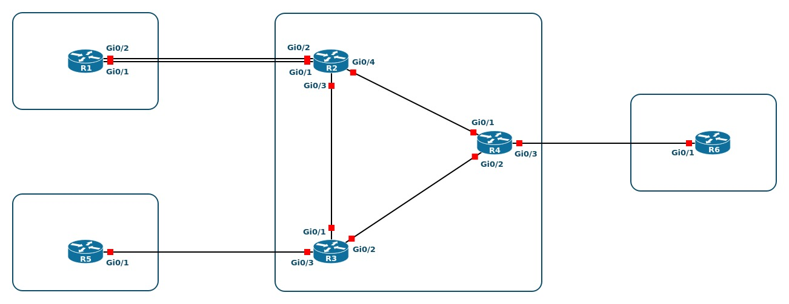

# ccnp-ccie-lab-generator
This project constructs a lab environment generator for CCNP/CCIE Enterprise Infrastructure Exam.
This project automates the process of redesigning files created by [mweisel](https://github.com/mweisel) to fit any CCNP/CCIE laboratory environment. It aims to streamline the adaptation of existing scripts and environments for improved efficiency and usability in any specific setup.

## Acknowledgments

I would like to thank [mweisel](https://github.com/mweisel) for providing the-orginal environment, which served as the foundation for this project.

## Installation

Provide installation instructions and usage details here.

## Ingredients

  * [Vagrant](https://www.vagrantup.com)
  * [QEMU](https://www.qemu.org)/[KVM](https://www.linux-kvm.org)
  * [libvirt](https://libvirt.org)
  * [vagrant-libvirt](https://github.com/vagrant-libvirt/vagrant-libvirt) >= 0.8.0
  * [Cisco IOSv Vagrant box](https://github.com/mweisel/cisco-iosv-vagrant-libvirt)
  * [Cisco IOSvL2 Vagrant box](https://github.com/mweisel/cisco-iosvl2-vagrant-libvirt)
  * [Python](https://www.python.org) >= 3.7
  * [Nornir](https://github.com/nornir-automation/nornir)
  * [Scrapli](https://github.com/carlmontanari/scrapli)

## Prerequisites

A\. Add the Cisco IOSv and IOSvL2 Vagrant boxes.

<pre>
$ <b>vagrant box list | grep iosv</b>
cisco-iosv        (libvirt, 15.9)
cisco-iosvl2      (libvirt, 2020)
</pre>

B\. Create a DHCP reservation entry for the management interface of each Cisco device.

Refer to [Controlling Vagrant Box Management IP](https://codingpackets.com/blog/controlling-vagrant-box-management-ip) for more information. Use [vagrant-libvirt-vnet.xml](files/vagrant-libvirt-vnet.xml) as a reference.

C\. Script updates the SSH client configuration file for the Cisco devices.

Use [sshconfig](files/sshconfig) as a reference.

## Steps

1\. Clone this GitHub repo and _cd_ into the directory.

<pre>
$ <b>git clone https://github.com/ujubu/ccnp-ccie-lab-generator.git</b>
$ <b>cd ccnp-ccie-lab-generator</b>
</pre>

2\. Create a router connections on input.txt as you can see as a example.
For more details, check the [input.txt](/input.txt) file.
<pre>
$ <b>
Device     Interface  Remote Device   Remote Interface
r1         g0/1       r2              g0/1
r1         g0/2       r2              g0/2
r2         g0/3	      r3	      g0/1
r2         g0/4       r4	      g0/1
r3         g0/2       r4	      g0/2
r3         g0/3       r5	      g0/1
r4         g0/3       r6	      g0/1
</b>
</pre>

Here is an image from the example lab network diagram JPG file:

3\. Create a Vagrantfile and YAML files for your own lab setup

<pre>
$ <b>python3 vagrantfile_generator.py</b>
</pre>

4\. Create a Python virtual environment.

<pre>
$ <b>source init_venv.sh</b>
</pre>

5\. Make sure KVM is active

<pre>
$ <b>kvm-ok</b>
$ <b>sudo modprobe kvm_intel</b>
</pre>

6. Instantiate the Cisco devices.

<pre>
$ <b>vagrant up</b>
</pre>

7\. Run the Python script to configure the Cisco devices for the INE labs.

<pre>
$ <b>python3 set_lab_config.py</b>
</pre>

8\. Connect to the Cisco devices via SSH.

<pre>
# OpenSSH
$ <b>virsh</b>
$ <b>list</b>
$ <b>console ccnp-ccie-lab-generator_r1</b>
</pre>

## License

This project is licensed under the [MIT License](LICENSE).
